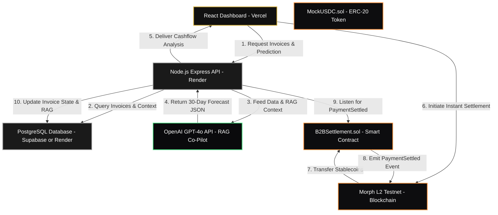

# Fehuvia: The Web3 SME Payment Portal & AI Cashflow Co-Pilot

## Executive Summary & Pitch
SMEs in the Philippines and Southeast Asia face a silent treasury killer: cash flow crunches exacerbated by 3-day traditional corporate bank settlement delays, high transaction fees, and reactive financial planning. 

**Fehuvia** is a premium Web3 financial co-pilot designed to give small businesses the treasury tools big banks take for granted. By combining **AI-driven predictive analysis** with **Morph L2 instant stablecoin settlements**, Fehuvia transforms reactive accounting into proactive, borderless wealth management.

---

## 🏗️ System Architecture & Data Flow

Fehuvia's architecture is divided into three core layers: a responsive, high-performance frontend; a secure, event-driven Node.js backend; and instant, low-cost decentralized smart contracts on the Morph L2 network.

### Architectural Diagram

### The 10-Step Operational Flow
1. **Request Predictions:** The buyer accesses the React dashboard. The frontend requests the latest invoice ledger and cashflow forecasts from the backend.
2. **Context Retrieval:** The backend queries the invoice history and company profiles from the PostgreSQL database.
3. **AI Co-Pilot Processing:** The backend feeds the raw transaction history and a context-aware system prompt into the OpenAI API (GPT-4o) via RAG.
4. **Decision Engine:** The AI returns a structured JSON payload containing 30-day runway predictions and classifies each pending invoice as:
   * `"Safe to Pay"` (cash buffers are healthy).
   * `"Delay"` (high risk of upcoming cash crunch).
   * `"Review"` (unusual activity or tight margin).
5. **Dashboard Render:** The React frontend receives the prediction and renders interactive charts and actionable buttons on the matte-black/gold interface.
6. **Instant Web3 Settle:** Clicking "Settle via Morph" on a `"Safe to Pay"` invoice prompts the user's Web3 wallet (e.g., MetaMask, Rabby) to sign a transaction.
7. **On-Chain Execution:** The smart contract pulls `MockUSDC` from the buyer’s wallet and instantly sends it to the supplier's address on the Morph L2 network.
8. **Event Emission:** Upon successful transfer, the `B2BSettlement` contract emits a `PaymentSettled` event.
9. **Event Listener Capture:** The backend’s daemon process (listening to the Morph L2 network via a WebSocket/RPC node connection) intercepts the event.
10. **State Reconciliation:** The backend marks the invoice as `settled` in the database, updates the RAG context layer, and the frontend dashboard automatically syncs to display "Cleared T+0".

---

## 🛠️ The Technology Stack & Deployment Blueprint

| Component | Technical Framework | Deployment Platform | Rationale for Selection |
| :--- | :--- | :--- | :--- |
| **Frontend** | **React (Vite)** • Tailwind CSS • Lucide React Icons • Recharts (analytics) | **Vercel** | • Lightning-fast global Edge network. • Automated Git integration for continuous integration. • Secure environment variable injection for API routing. |
| **Backend API & Daemon** | **Node.js + Express** • Ethers.js / Viem (Web3) • OpenAI Node SDK | **Render (Web Service)** | • Native, persistent process execution required for the background blockchain event listeners. • Automatic SSL certificates. • High availability with simple horizontal scaling. |
| **Database** | **PostgreSQL** • `pgvector` extension for future vector embeddings. | **Supabase** or **Render Postgres** | • Structured relational storage for highly connected invoice tables. • Fast vector indexing capabilities for localized RAG lookup. |
| **Smart Contracts** | **Solidity (0.8.24)** • Hardhat compilation & scripts • OpenZeppelin ERC20 | **Morph L2 Testnet** | • **Morph Network:** Layer 2 EVM with sub-cent gas fees and near-instant transaction finality. • Hardhat CLI scripts will be used to deploy directly via the Morph Testnet RPC node. |
| **Wallet Integration** | **Wagmi / Viem** • RainbowKit UI Components | Direct Integration | • Premium, native Web3 modal connection UI. • Excellent state management for contract read/write actions. |

---

## 🔒 Security & Environment Configuration

### Key Management
* **User Wallet Keys:** Never touched or stored by the application. Transactions are initiated on the client side and signed locally inside the user's Web3 wallet (MetaMask, Rainbow, etc.).
* **Deployment Wallet Keys:** The private key used to deploy contracts to the Morph Testnet is stored exclusively in a local `.env` file on the developer's machine (which is ignored by Git).
* **API Access Keys:** OpenAI keys and database connection strings are stored securely in Vercel's and Render's environment dashboards.

---

## 🎯 The Hackathon Sprint Plan (Remaining Deliverables)

### Phase 1: Smart Contracts & Web3 Base (Days 1–2)
* [ ] Write `MockUSDC.sol` (ERC-20 standard stablecoin with a public minting/faucet handler).
* [ ] Write `B2BSettlement.sol` (Handles invoice verification, stablecoin settlement, and emits the `PaymentSettled` event).
* [ ] Test locally using Hardhat Network.
* [ ] Deploy to **Morph Testnet** and verify contracts on the Morph Block Explorer.

### Phase 2: Express Backend & AI Co-Pilot (Days 3–4)
* [ ] Set up PostgreSQL schema (Invoices, Users, Suppliers).
* [ ] Build Express REST API routes for invoice CRUD operations.
* [ ] Configure RAG context builder and system prompts with the OpenAI GPT-4o API.
* [ ] Implement the `ethers.js` event listener daemon to parse `PaymentSettled` logs from the Morph Testnet.

### Phase 3: Frontend Connect & End-to-End Testing (Days 5–6)
* [ ] Replace mockup frontend states with actual `fetch` requests targeting the Render backend.
* [ ] Hook up RainbowKit / Wagmi inside the dashboard to initiate actual Morph stablecoin settlements.
* [ ] Map out the final architecture diagram in premium SVG for the project repository.

### Phase 4: Polish & Submission (Days 7–8)
* [ ] Deploy Frontend to **Vercel** and Backend to **Render**.
* [ ] Conduct end-to-end integration testing (e.g., creating an invoice -> viewing the AI forecast -> settling it via wallet -> verifying automatic status update).
* [ ] Record the 2-minute project demo video and finalize the readme.
